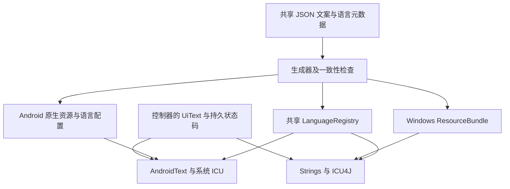

# NearbyIM 多端多语言架构

翻译唯一来源是 `i18n/config.json` 与 `i18n/messages/<BCP-47 tag>.json`。当前完整目录支持简体中文 `zh-Hans`、英语 `en`、繁体中文 `zh-Hant`、日语 `ja`、韩语 `ko`，设置默认跟随系统，保留旧 `zh`/`en` 选择的兼容性。新增语言通过注册元数据和翻译目录扩展，不在界面里判断中英文。

当前五种语言各有 299 个完整文案键；两端版本号同样来自 `config.json`，本轮为 0.3.1。设置中的原名为简体中文、English、繁體中文、日本語、한국어。三种新语言覆盖界面、权限、错误、通知、帮助与关于；不翻译用户聊天或已有昵称。

消息键保留 lowerCamelCase，跨端相同含义共用同一键；平台不同的说明使用独立键。所有参数使用 ICU MessageFormat，包括复数、数字、日期；不拼接翻译句子。聊天内容、昵称、身份、端口、协议常量和诊断日志不翻译。

`tools/generate-i18n.py` 校验并生成 Android 原生 string 资源、键到 `R.string` 的映射、系统语言配置，及 Windows properties 资源。生成文件纳入版本控制，构建前执行 `--check` 防止漂移。缺失、额外或重复键、资源名冲突和参数不一致必须失败。运行时未知系统语言回退英语，单键翻译缺失回退英语。

公共 Java 接口位于 `dev.ghost.nearbyim.i18n`：

- `LanguageRegistry.SYSTEM`、`VERSION`；`languages()` 返回有 `tag`、`nativeName`、`rtl` 字段的 Language 对象。
- `LanguageRegistry.normalizeSelection(String)` 兼容旧选择并规范化；`resolve(String, Locale)` 返回 Language；`locale(String, Locale)` 返回有效 Locale。
- `UiText.of(String key, Object... args)` 保存语言无关的 `key` 与 `arguments`；`UiText.EMPTY` 表示没有提示。
- `LocalizedIOException(UiText text[, Throwable cause])` 携带结构化错误，不解析中文异常文本。
- Android 生成 `I18nResources.id(String key)`；读原生资源后由系统 `android.icu.text.MessageFormat` 格式化。
- Windows 通过 ResourceBundle 加载资源，使用 ICU4J MessageFormat，与安卓采用同一格式契约。

控制器与存储只保存状态码。`UiText` 可序列化，只在显示时解析，参数可包含另一个 `UiText`（例如连接方式），昵称和路径作为原始参数传入。`LocalizedIllegalArgumentException` 同样携带 `text`，用于地址格式校验；异常 `getMessage()` 保留诊断键。旧安卓中文消息状态在 SQLite v3 升级时转换为 `pending` / `delivered` / `unknown`，历史文字与信任保持原样。NIM2 协议、设备密钥、许可与回执规则不变，与现有 0.2.0 安卓端兼容。所有错误、通知、权限解释、无障碍标签、日期、帮助和关于内容必须经过翻译层。

安卓语言选择通过配置 Context 和 Android 13 系统应用语言接口适配；重建界面前保存草稿、滚动位置、选择对象和待处理动作，服务保持连接。通知在语言切换后重新渲染。Windows 对现有界面及已打开对话框刷新语言和方向，保留连接与草稿。

验收包含语言回退、旧偏好、变量/复数/转义、跨端资源一致、持久状态升级、通知与提示、带连接和草稿的语言切换。系统自己的配对和权限窗口由系统管理其语言。

## 维护文案

1. 在所有 `i18n/messages/*.json` 中添加相同语义键，以简体中文为编辑源，英文为运行时回退。Android 和 Windows 特有说明分别使用 `androidHelpBody` / `helpBodyWindows` 等键。
2. 写 ICU 数字参数，例如 `"{0} 想和你聊天"`、`"{0, plural, one {# device} other {# devices}}"`、`"{0,date,long}"`。两种语言的参数编号与类型一致，复数类别可根据语言不同；复杂参数内必须有 `other`。英文普通撇号可以直接写 `I'm {0}`；字面花括号使用 ICU 引号，参数里的花括号与撇号无需转义。
3. 执行 `python3 tools/generate-i18n.py`，提交目录与生成产物。不要手改 XML / properties / 生成类。JSON 重复键、缺少翻译、多余键、参数不符和 Android 资源名冲突都会拒绝生成。
4. 控制器产生 `UiText.of("requestBody", nickname)`；平台显示层使用 `AndroidText.get(context, text)` 或 `Strings.text(text)`。不要保存翻译后的状态，也不要以提示文字判断逻辑。
5. 执行 `sh tools/test-i18n.sh`、`sh tools/check-source.sh` 及平台构建。Windows 使用同名 `.ps1` 检查脚本。构建读取同一 `appVersion`，语言目录也用于生成 Windows 运行时的 locale 打包范围。

Android 原生字符串中的 `formatted="false"` 表示不使用 printf；它们仍由 ICU 格式化。生成器处理 XML、Android 的引号和反斜杠及 properties 的换行规则，UTF-8 中文保持可读。缺少某个本地化 Android 资源由默认英文资源接管；Windows ResourceBundle 有同样的逐键回退。未知消息键显示通用错误，不把内部键泄露给用户。

## 新增语言与区域

在 `i18n/config.json` 的 `languages` 注册 BCP-47 标签、语言原名、Android qualifier、旧名别名及 `rtl`。例如法语标签 `fr` / qualifier `fr`；带脚本的语言使用 Android `b+语言+脚本`。创建包含全部键的 `i18n/messages/<tag>.json`，生成并运行测试，无需在界面里加入条件判断。Android 13+ 系统应用语言列表和 Windows 语言菜单会从注册表生成。

显式选择规范化后保存，如旧 `zh`、`zh_CN` → `zh-Hans`；英语区域及拉丁脚本变体落到 `en`。跟随系统时保留受支持语言的地区信息，例如英国英语按英国格式显示日期和时间；Unicode locale 扩展（例如 `zh-CN-u-nu-hanidec` 的数字格式）保留，不影响翻译选择。`zh-TW`、`zh-HK`、`zh-MO` 和 `zh-Hant-*` 选择繁体中文，`ja-JP`、`ko-KR` 及原生脚本标签分别选择日语、韩语；显式 `zh-Hans-HK` 仍选择简体。繁体中文采用通用繁体、台湾常用软件术语，目前没有独立香港文案目录。未知系统语言回退 `en`。未知持久选择回到 `system`。Windows 在启动时读取系统显示 locale，并在活动窗口/定时刷新时重新解析进程默认 locale；Windows 系统显示语言通常需要注销后生效。

新 RTL 语言使用注册表方向：Android 配置 Context 的 layout direction，Windows 对主窗口、菜单、列表、已打开对话框应用 ComponentOrientation。字体必须覆盖新语言；本轮逐条检查了现有 Noto CJK 字体对五种语言全部文案的字形覆盖，不额外打包日语、韩语或繁体字体。安卓使用系统原生字体。RTL 语言仍未作为正式翻译提供。

平台框架仅存在于适配层。共同语言注册表、语义消息与异常是 Java 类，既不依赖 Android Context 也不依赖 Swing，未来端可以复用相同目录与键，同时接入自身 ICU 与本地语言设置。

## 升级与验证

安卓 SQLite v1/v2 → v3 会迁移旧状态，保留正文、设备身份及已有信任；Windows 保留现有便携数据和旧版默认昵称。新安装的默认昵称按首次使用语言生成并持久化，此后切换语言不改昵称。Android App Bundle 关闭语言拆分，离线也有全部已注册语言资源。

安卓安装升级必须使用原签名密钥。数据库迁移支持保留数据升级，但 CI 的临时调试证书不能覆盖另一个证书签名的旧 APK；不要通过卸载旧应用验证用户数据迁移。

0.3.0 的[最终构建](https://github.com/GHOST-AKU/wozai/actions/runs/37003827341)通过生成器 8 项测试、语言解析 23 项检查、339 处字面消息键引用检查和 Windows 631 项 ICU/目录/回退检查。Android API 26 和 34 各通过 120 项原生检查，覆盖真实连接中的界面重建、草稿与光标、阅读位置、待处理聊天许可、服务身份、保存回执及后台通知换语言；Windows 自带运行时和完整 JDK 都通过实时语言与对话框刷新检查。

在临时测试目录注册法语、阿拉伯语 RTL、塞尔维亚语拉丁脚本目录，验证生成和运行时加载，无需增加平台语言分支。这证明扩展机制可用；0.3.1 在该机制下新增繁体中文、日语和韩语，不新增运行时依赖。真实蓝牙硬件、系统权限/蓝牙启用窗口跨语言返回和各语言读屏，需要按 [device-test.md](device-test.md)继续验收。详细证据与下载见 [verification.md](verification.md)。
